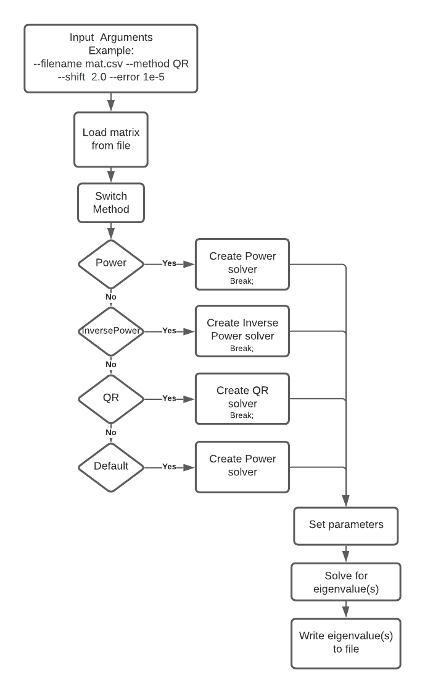

# PCSC-Eigenvalue-problems
Project for the Programming concept in Scientific Computing course  


This project implements different numerical methods to solve the eigenvalues of a matrix.  
The different numerical methods are Power method, Inverse Power method with and without shift  
and the QR method.

## Prerequisites
*C++17  
*eigen3

## Installation
Install google test:
```
git submodule update --init
```
## Build CMake Project 
```
mkdir build
cd build
cmake ..
make
```


## Usage

* --method to specify the method used to find eigenvalues: power, inversepower, or qr.  
Default: power
* --filename to specify the name of the file in 'data/' used as input matrix.
Default: mat.csv
* --shift to specify a shift used in inverse power method.  
Default: 0
* --error to specify the error criterion used to stop the algorithm.  
Default: 0.0001

## Flow of program



## Limitations and problems 
