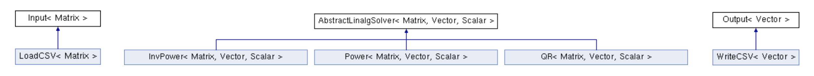

# PCSC-Eigenvalue-problems
Project for the Programming concept in Scientific Computing course. 


This project implements different numerical methods to solve the eigenvalues of a matrix.  
The different numerical methods are Power method, Inverse Power method with and without shift  
and the QR method.

* The power method returns the largest eigenvalue in magnitude.
* The inverse power method returns the smallest eigenvalue in magnitude.
* The shifted inverse power method returns the closest eigenvalue to a given shift.
* The QR method returns all the eigenvalues.

The implemented classes are depicted in the following diagram:  




## Prerequisites
* `C++17`
* `Doxygen`
* `eigen3`
* `GoogleTest`

The two latter are installed as git submodules (see below).

## Installation

Clone the repo:
```
git clone https://github.com/patrontheo/PCSC-Eigenvalue-problems.git
cd PCSC-Eigenvalue-problems
```

Install GoogleTest and Eigen libraries:
```
git submodule update --init
```

## Build CMake Project 
```
mkdir build
cd build
cmake ..
make
cd ..
```

## Create Doxygen documentation
Install Doxygen:
https://www.doxygen.nl/manual/install.html

Create the documentation:
```
cd src
doxygen ../Doxyfile
cd ..
```
To view the documentation, open the `html/index.html` file.

## Usage
### Command line arguments
The getopt c++ library is used to parse the command line arguments.  
In order to choose which method to use to find the eigenvalue(s), the user can provide  
some options. The program can run without any options provided and will use the default  
options as reported below.  
* `--method` to specify the method used to find eigenvalues: power, inversepower, or qr.  
Default: power
* `--filename` to specify the name of the file in 'data/' used as input matrix.  
Default: mat.csv
* `--shift` to specify a shift used in inverse power method.  
Default: 0
* `--error` to specify the error criterion used to stop the algorithm.  
Default: 0.0001

As an example, the following command will read `mat.csv` in the folder `data` and use  
the shifted inverse power solver with `shift = 5.4` and the error criterion used to   
check the convergence of the algorithm will be set to `1e-5` (command to be executed  
in the `build` folder):  
`./main --filename mat.csv --method inversepower --shift 5.4 --error 1e-5`  

### Type of file parsing
In order to choose which loader class to use to load the input matrix, the given filename  
extension is parsed from the filename and the appropriate loader is chosen depending on   
the extension provided. Here, we implemented only a CSV loader, so the program will  
return an error code 1 if a different format is provided. The program is easily adaptable  
to add another loader.

### Output
The computed eigenvalue(s) are written in the `data/eigenvalues.csv` file.

## Flow of program


## List of features

* Changable numerical methods for solving for eigenvalues. 
* Easy conversion to variations of matrices (ex: complex matrices) thanks to the use of templated classes.
* No limitations on input matrix size.
* Choice of accuracy with adjustable error. 
* Easy addition of new dataloader.

## Tests
This project uses the GoogleTest library.  
The tests are stored in the `test/test.cc` file.  
To run the tests, place yourself in the `build` directory and run the command:  
`./test_pcsc`  

The following tests are implemented:
* `power.solve3x3` checks that the eigenvalue obtained with the power method is valid on a 3x3 matrix.
* `power.solve5x5` checks that the eigenvalue obtained with the power method is valid on a 5x5 matrix.
* `inverse_power.solve3x3` checks that the eigenvalue obtained with the inverse power method is valid on a 3x3 matrix.
* `inverse_power.solve5x5` checks that the eigenvalue obtained with the inverse power method is valid on a 5x5 matrix.
* `inverse_power.shifted_solve3x3` checks that the eigenvalue obtained with the shifted inverse power method is valid on a 3x3 matrix.
* `inverse_power.shifted_solve5x5` checks that the eigenvalue obtained with the shifted inverse power method is valid on a 5x5 matrix
* `qr.solve3x3` checks that the eigenvalue obtained with the qr method are valid on a 3x3 matrix.
* `qr.solve5x5` checks that the eigenvalue obtained with the qr method are valid on a 5x5 matrix.
* `load_csv.load_matrix` checks that the matrix loaded from csv file with load_matrix is valid.
* `abstract_linalg_solver.set_get_matrix` checks that the getter and setter methods for matrix_ attribute are correct.
* `abstract_linalg_solver.set_get_error` checks that the getter and setter methods for error_ attribute are correct.
* `abstract_linalg_solver.set_get_shift` checks that the getter and setter methods for shift_ attribute are correct.

## Convergence criterion
To check the convergence of each algorithm, the attribute `error_` is used:
* In power and inverse power methods, we consider that the algorithm has converged when the residual is lower than  
`error_`: `||Ax-ux||<error_`, with A the input matrix, x the eigenvector, and u the computed eigenvalue.
* In the QR method, we consider that the algorithm has converged when the following inequality is met:     
`||u_old - u_new|| < error_` with u_old/new the vector of computed eigenvalues.

## Limitations and problems 
* Some of the limitations of this program lie in the numerical algorithms implemented. If the matrix contains eigenvalues of the same magnitude, the algortihms will not be able to converge. Moreover, if the matrix is singular, which means that it contains eigenvalues equal to zero, the algorithm with also not converge.   
* For the inverse power method, if the provided shift is exactly an eigenvalue of the matrix, or if the shift is exactly between two eigenvalues (e.g. shift = 3 and 2 and 4 are eigenvalues), the algorithm may not converge, or take a big amount of time to do so. To avoid this behaviour, a small random number (in [-1e-4; 1e-4]) is added to the shift. This way, the shift is never exactly on an eigenvalue or between two eigenvalues, making the computation smoother. 
* Moreover, the algortihm doesn't solve for complex eigenvalues. Thus, to ensure the valitity of the computation, the input matrix must be either symmetric or have real eigenvalues. However, as our class are templated, the program is easily editable to be able to compute complex eigenvalues.

## Perspectives
* The program can be adapted to support complex eigenvalues computation. 
* The program can be adapted to read matrix from different types of file.
